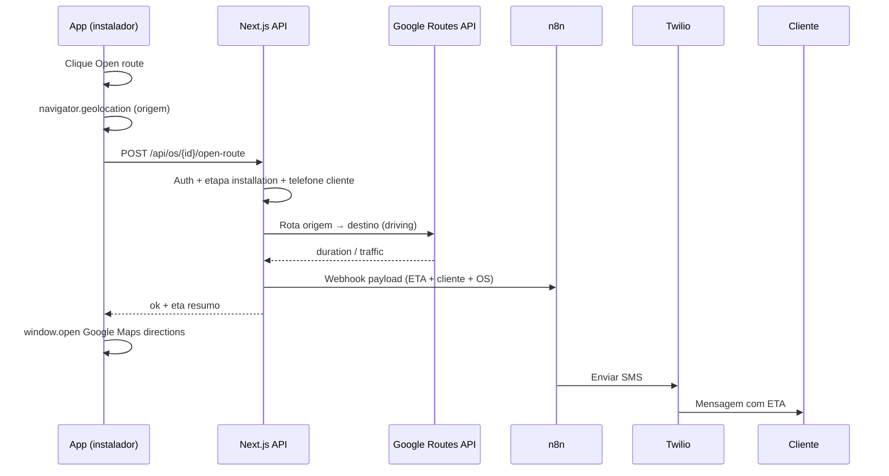

# Open Route → ETA → SMS (n8n + Twilio)

**Status:** planejado — **não implementado** (documentação para implantação em breve).

**Objetivo:** quando o instalador clicar em **Open route** na etapa **Installation** (workspace `/os/[id]`), o sistema deve:

1. Calcular tempo estimado de chegada (ETA) até o endereço do cliente.
2. Disparar webhook para **n8n**.
3. n8n envia **SMS via Twilio** ao cliente com a estimativa.
4. Abrir Google Maps com rota de navegação para o instalador.

Alinhado a `docs/ARCHITECTURE.md` (SMS operacional, Google Routes API, auditoria).

---

## Comportamento atual (código em produção)

| Item | Situação |
|------|----------|
| Botão **Open route** | Link `<a href>` — sem JavaScript no clique |
| Componente | `src/components/ordens-servico/workspace/os-workspace-resumo.tsx` |
| URL gerada | `clienteMapsUrl()` em `src/lib/ordens-servico/visita-comercial.ts` |
| Tipo de link | Google Maps **search** (localização), não **directions** (rota com origem) |
| GPS do instalador | Não capturado |
| Cálculo de ETA | Não existe |
| Webhook / SMS | Não existe |

O botão aparece no resumo do workspace em **todas** as etapas (não só Installation). Na implantação, restringir SMS à etapa `installation` (e opcionalmente `commercial` para visita técnica).

### Prioridade da URL do cliente

1. `cliente.google_maps_url` (Places)
2. `latitude` + `longitude`
3. `endereco_formatado` (query encoded)

---

## Por que não há ETA hoje

Abrir o Google Maps **não devolve** duração ou horário de chegada para o app. O ETA só existe dentro do app Maps.

Para obter ETA programaticamente é necessário:

- **Origem:** coordenadas do instalador no momento do clique (`navigator.geolocation`).
- **Destino:** `cliente.latitude` / `cliente.longitude` (ideal) ou geocode do endereço.
- **API:** Google **Routes API** (Compute Routes) ou **Distance Matrix API** no **servidor**.

Stub existente (sem chamada externa): `src/lib/ordens-servico/route-optimization.ts`.

Padrão de webhook n8n já usado no projeto: `src/lib/ordens-servico/os-ficha-tecnica-webhook.ts` + `N8N_WEBHOOK_*` em `.env`.

---

## Fluxo alvo



---

## Dados já disponíveis no banco / app

| Campo | Uso |
|-------|-----|
| `clientes.telefone` | Destino do SMS (Twilio) |
| `clientes.nome` | Personalização da mensagem |
| `clientes.endereco_formatado` | Texto no SMS / fallback destino |
| `clientes.latitude`, `clientes.longitude` | Destino da rota |
| `clientes.google_maps_url` | Abrir Maps (melhorar para `dir`) |
| `ordens_servico.id`, `etapa_atual` | Validação e auditoria |
| `equipes.nome` | Contexto no SMS |
| `usuarios.nome` | Nome do instalador (opcional) |

Timezone operacional: `America/New_York` (`OPERATIONAL_TZ` em `src/lib/ordens-servico/datetime.ts`).

---

## Alterações previstas no código (checklist)

### Frontend

- [ ] Trocar `<a href={mapsUrl}>` por **botão** com handler assíncrono em `os-workspace-resumo.tsx`.
- [ ] Solicitar `navigator.geolocation.getCurrentPosition` no clique (HTTPS obrigatório).
- [ ] Chamar API interna antes ou em paralelo à abertura do Maps.
- [ ] Abrir URL **directions** (não search):

  ```
  https://www.google.com/maps/dir/?api=1
    &origin={originLat},{originLng}
    &destination={destLat},{destLng}
    &travelmode=driving
  ```

- [ ] Estados de UI: loading, erro GPS negado, erro sem telefone, sucesso silencioso.
- [ ] (Opcional) Esconder ou desabilitar SMS fora da etapa `installation`.

### Backend

- [ ] `POST /api/os/[id]/open-route` (ou server action equivalente).
- [ ] Validar sessão Supabase + permissão na OS/equipe.
- [ ] Validar `etapa_atual === 'installation'` (regra de negócio).
- [ ] Chamar Google Routes API com chave **server-side**.
- [ ] Disparar webhook n8n (`dispatchInstallerOpenRouteWebhook` — espelhar ficha técnica).
- [ ] Registrar auditoria / timeline (`installer_en_route` ou tipo dedicado).
- [ ] **Dedupe:** não reenviar SMS se novo clique em &lt; 15–30 min (mesma OS).

### Lib sugerida

- [ ] `src/lib/ordens-servico/google-routes.ts` — Compute Routes / parse duration.
- [ ] `src/lib/ordens-servico/os-open-route-webhook.ts` — payload + `fetch` n8n.
- [ ] Estender `clienteMapsUrl` ou criar `clienteDirectionsUrl(origin, cliente)`.

### n8n

- [ ] Novo workflow (ex.: `n8n/ccshower-open-route-eta-sms.json`).
- [ ] README: `n8n/README-open-route-eta.md`.
- [ ] Trigger: Webhook POST.
- [ ] Nó Twilio: SMS com template EN (cliente EUA).
- [ ] Tratamento: telefone inválido, falha Twilio, log.

### Variáveis de ambiente (futuras)

```env
# Google Routes — somente servidor (não expor ao browser)
GOOGLE_MAPS_SERVER_API_KEY=AIzaSy...

# n8n — disparo ao clicar Open route
N8N_WEBHOOK_OPEN_ROUTE_URL=https://seu-n8n.app/webhook/...
# Reutilizar o mesmo segredo da ficha técnica ou dedicado:
N8N_WEBHOOK_SECRET=...

# Twilio — configurar como credencial no n8n (não no Next.js)
# TWILIO_ACCOUNT_SID / TWILIO_AUTH_TOKEN / TWILIO_FROM_NUMBER
```

Habilitar no Google Cloud: **Routes API** (ou Distance Matrix) + billing. A chave `NEXT_PUBLIC_GOOGLE_MAPS_API_KEY` atual cobre Places/JS — **não** substitui a chamada server de rotas.

---

## Payload sugerido — webhook app → n8n

```json
{
  "event": "installer_open_route",
  "os_id": "uuid",
  "empresa_id": "uuid",
  "etapa_atual": "installation",
  "cliente": {
    "id": "uuid",
    "nome": "STEPHANIE C.",
    "telefone": "+19045551234",
    "endereco_formatado": "3178 WAVERING LN, MIDDLEBURG, FL 32068"
  },
  "destino": {
    "latitude": 30.12,
    "longitude": -81.86
  },
  "origem": {
    "latitude": 30.05,
    "longitude": -81.72,
    "captured_at": "2026-06-09T18:30:00.000Z"
  },
  "eta": {
    "minutos": 28,
    "chegada_local": "2:45 PM",
    "chegada_iso": "2026-06-09T18:45:00-04:00",
    "distancia_milhas": 12.4,
    "com_trafego": true
  },
  "equipe_nome": "Design & Projects",
  "instalador_nome": "John Smith",
  "timezone": "America/New_York"
}
```

Header de autenticação (mesmo padrão ficha técnica): `Authorization: Bearer {N8N_WEBHOOK_SECRET}` ou `x-n8n-webhook-secret`.

---

## Template SMS (inglês — cliente EUA)

> Hi {firstName}, our installation team is on the way to {shortAddress}. Estimated arrival: about {etaMinutes} minutes (around {etaTime}). — CC Shower

Variações:

- Sem GPS / sem ETA: *"Our team is heading to your address and will arrive shortly."*
- Sempre usar linguagem aproximada (*about*, *around*) — trânsito muda.

---

## Casos de borda

| Cenário | Comportamento sugerido |
|---------|------------------------|
| GPS negado pelo instalador | Abrir Maps sem origem; SMS genérico sem minutos |
| Cliente sem `telefone` | Bloquear SMS; toast no app; ainda abrir Maps |
| Cliente sem lat/lng | Geocoding server-side antes da rota |
| Clique repetido | Dedupe por janela de tempo |
| Instalador offline | Fila retry ou falha graciosa |
| Endereço fora da Flórida | Mesma lógica; validar unidade operacional |

---

## Fases de implementação

### Fase 1 — MVP

- Botão + GPS + API Routes + webhook n8n + SMS Twilio + abrir directions.
- Apenas etapa `installation`.

### Fase 2 — Operação

- Timeline / auditoria obrigatória (`ARCHITECTURE.md`).
- Dedupe SMS.
- Métricas no Centro Operacional (opcional).

### Fase 3 — Refino

- ETA com tráfego em tempo real.
- Fallback origem = endereço da unidade (depósito).
- Mesmo fluxo na visita comercial (`commercial`).

---

## Referências no repositório

| Arquivo | Papel |
|---------|--------|
| `src/components/ordens-servico/workspace/os-workspace-resumo.tsx` | Botão Open route (UI) |
| `src/lib/ordens-servico/visita-comercial.ts` | `clienteMapsUrl()` |
| `src/lib/ordens-servico/os-ficha-tecnica-webhook.ts` | Modelo de dispatch n8n |
| `src/lib/ordens-servico/route-optimization.ts` | Stub rotas |
| `src/lib/ordens-servico/agenda-equipe-dia.ts` | `RotaParadaAgenda` (paradas futuras) |
| `docs/ARCHITECTURE.md` | SMS, Google APIs, auditoria |
| `n8n/README-ficha-tecnica.md` | Padrão credenciais n8n |

---

## Decisões em aberto (definir antes de codar)

1. SMS só em **installation** ou também em **commercial** (visita)?
2. Janela de **dedupe** (15 vs 30 min)?
3. ETA com ou sem **tráfego** (custo/latência Google)?
4. Twilio **From** number e opt-in/compliance (TCPA) — revisar com cliente.
5. Registrar evento em `agenda_eventos` ou tabela de auditoria dedicada?

---

*Última revisão: jun/2026 — análise feita a partir do workspace OS e botão Open route na etapa Installation.*
